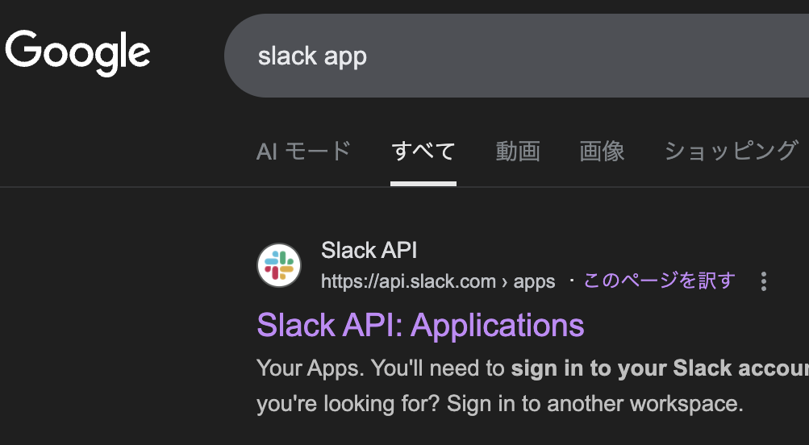

# Slack Submit Notifier

I recently started participating in Kaggle competitions, but I couldn’t find an easy way to monitor submission processing times.
So, I built a simple monitoring tool myself.

This tool monitors the submission status of Kaggle competitions in real time and automatically notifies Slack of status updates (e.g., pending → complete, pending → error).
It periodically fetches the latest submission data from the Kaggle API and sends a formatted Slack message whenever a status change is detected.

The tool works even with the free Slack plan, making it convenient for team submission tracking and progress monitoring after team merges.
---

# Features

- Real-time monitoring of Kaggle competition submissions
- Automatic detection of submission status changes (e.g., pending → complete, pending → error)
- Automatic notifications to a specified Slack channel
- Notifications include both public and private leaderboard scores (if available)
- Unified configuration for polling and notification intervals (in minutes)


---

## 🧰 Requirements
## 1. Create a Slack Account
### 1.1 Create a Workspace
- Email address
- Workspace name
- Username
- Member invitation email addresses


※ You can skip this step if you already have a Slack account.

## 1.2 Create a Notification Channel


## 2. Create a Slack App
### 2.1 Search for “Slack App” and open the following link


### 2.2 Click “Create an App”


### 2.3 Select “From scratch”


### 2.4 Enter the required information
- Choose any app name
- Select the workspace created in step 1


## 2.5 Select “Incoming Webhooks”


## 2.6 Click “Add New Webhook”


## 2.7 Choose the target channel
Select the channel created in step 1.2


## 2.8 Copy the Webhook URL
You’ll use this value as an argument when running the code


## 3. Kaggle API Authentication

Make sure your Kaggle API key is properly configured:

```bash
mkdir -p ~/.kaggle
cp kaggle.json ~/.kaggle/
chmod 600 ~/.kaggle/kaggle.json
```

> You can download your API key from [Kaggle Account Settings → Create New API Token](https://www.kaggle.com/settings).

---

### 2. Install dependencies

```bash
pip install kaggle requests
```

---

### 3. 5. (Recommended) Use tmux for Persistent Execution

If you plan to run this notifier continuously, it’s convenient to use tmux so that the process keeps running even after closing the terminal.

```
sudo apt install tmux -y
tmux new -s kaggle-notifier
```

Run the notifier script inside the tmux session to keep it active in the background.

### 4. Run the notifier

```bash
python main.py   --competition jigsaw-agile-community-rules   --slack-webhook "https://hooks.slack.com/services/XXX/YYY/ZZZ"   --interval-min 5
```

| Argument | Required | Default | Description |
|-----------|-----------|----------|-------------|
| `--competition` | ✅ | – | Kaggle competition slug (e.g., `jigsaw-agile-community-rules`) |
| `--slack-webhook` | ✅ | `$SLACK_WEBHOOK_URL` | Slack Incoming Webhook URL |
| `--interval-min` | Optional | `10` | Interval (minutes) for both polling and reporting |
